<h1 align="center" style="font-weight: bold;">Trilha Backend LEDS - By Victor Marins</h1>

<div style="text-align: center;">

</div>

<p align="center">
  <b>API desenvolvida para o desafio da Trilha Backend LEDS</b>
</p>

<h2>💻 O que você encontrará?</h2>
 
* C#
* .NET CORE
* MySQL
* Entity Framework 
* Docker  
* Padrão MVC
* Clean Code
* DTOs
* Migrations
* As devidas validações
* Global Exception Handler
* Documentação com Swagger

<h2>💡Listagem dos diferenciais requisitados no desafio</h2>

* Foi criado um serviço com o problema
* Utilizei banco de dados(MySql)
* Implementei Clean Code
* Implementei um dos padrões da tecnologia escolhida(MVC)
* Dockerizei a aplicação

<h2>Endpoints que respondem o desafio</h2>

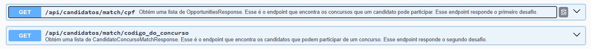
<h2>Modelagem</h2>

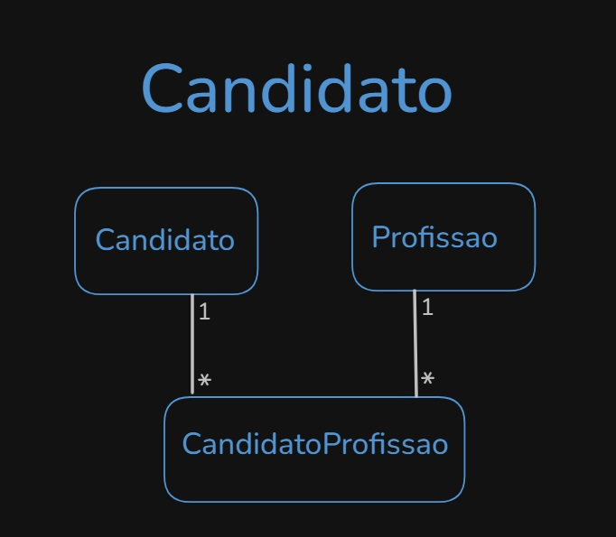
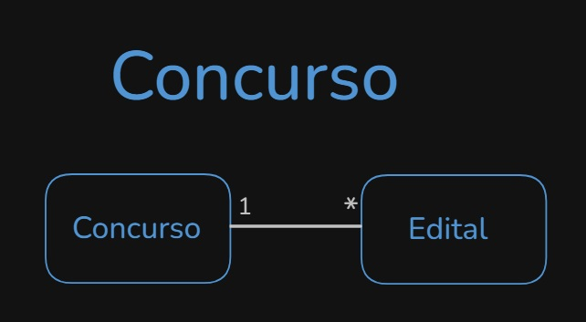

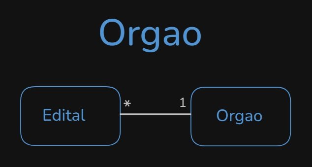
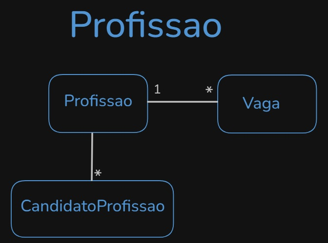
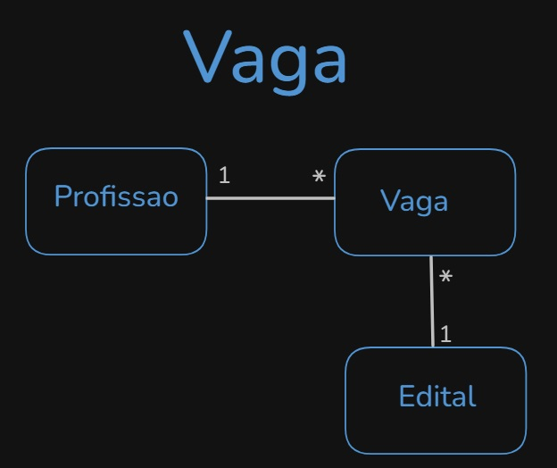
 
<h2>🚀 Como utilizar?</h2>

###  Pré-requisitos

1. **Instalar Docker Desktop**  
   Baixe e instale o Docker Desktop de acordo com o seu sistema operacional:  

   - [Docker Desktop para Windows/Mac](https://www.docker.com/products/docker-desktop)
2. **Verifique a instalação do Docker**  
   Após a instalação, execute os seguintes comandos no terminal para garantir que o Docker está instalado corretamente:
   ```bash
   docker --version
   docker-compose --version
   ```
   Isso deve exibir as versões instaladas do Docker e Docker Compose.

### 🛠️ Como rodar a aplicação

1. **Navegue até o diretório onde você deseja clonar o projeto.**  

2. **Abra o Terminal (ou o Git Bash, se estiver no Windows).**    

3. **Clonar o repositório**  
   Clone o projeto do GitHub

4. **Ir para o diretório do projeto**  
   Navegue até a pasta do projeto clonado

5. **Construir e rodar os contêineres**  
   No diretório do projeto, execute o comando abaixo para construir as imagens e iniciar os containers com o Docker Compose:
   ```bash
   docker-compose up --build
   ```
    O `--build` garante que as imagens sejam construídas a partir do Dockerfile.
    Se a imagem já foi construída e você não quiser reconstruí-la, pode rodar apenas:
    ```bash
    docker-compose up
    ```
6. **Verificar se tudo está rodando**  
   Após o comando acima, o Docker Compose deve iniciar todos os containers definidos no arquivo `docker-compose.yml`. Você pode verificar se os containers estão rodando corretamente com:
    ```bash
    docker ps
    ```
    Caso só apareça o container do banco de dados, vá até o docker hub e suba o container da aplicação novamente.
7. **Acessar a documentação**  
   Feita a verificação que os containers estão rodando perfeitamente, basta abrir o navegador e acessar a URL da documentação: [http://localhost:8080/swagger/index.html](http://localhost:8080/swagger/index.html).

<h2>Observação</h2>
Ao executar os containers as migrations serão aplicadas no DB e o banco será populado com as informações fornecidas pelo desafio.
<h2>Preview da documentação</h2>

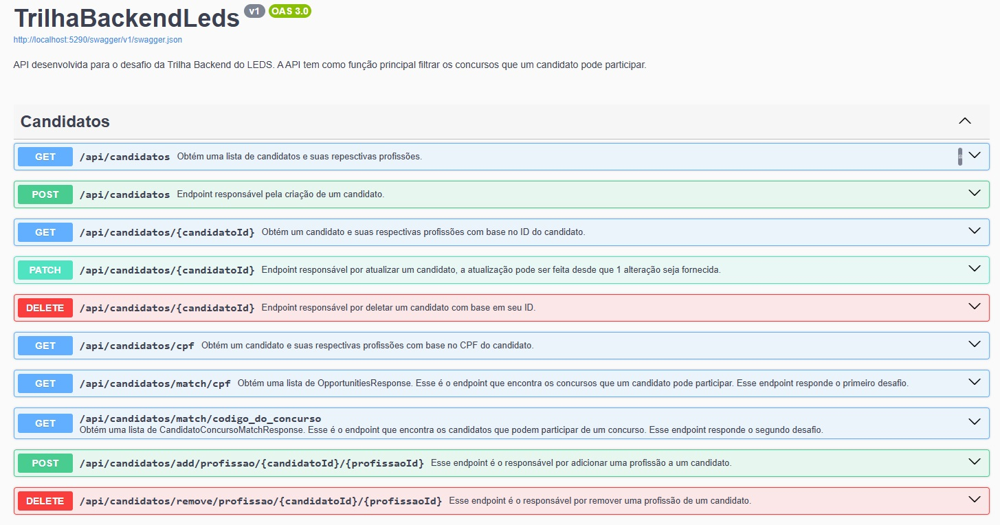
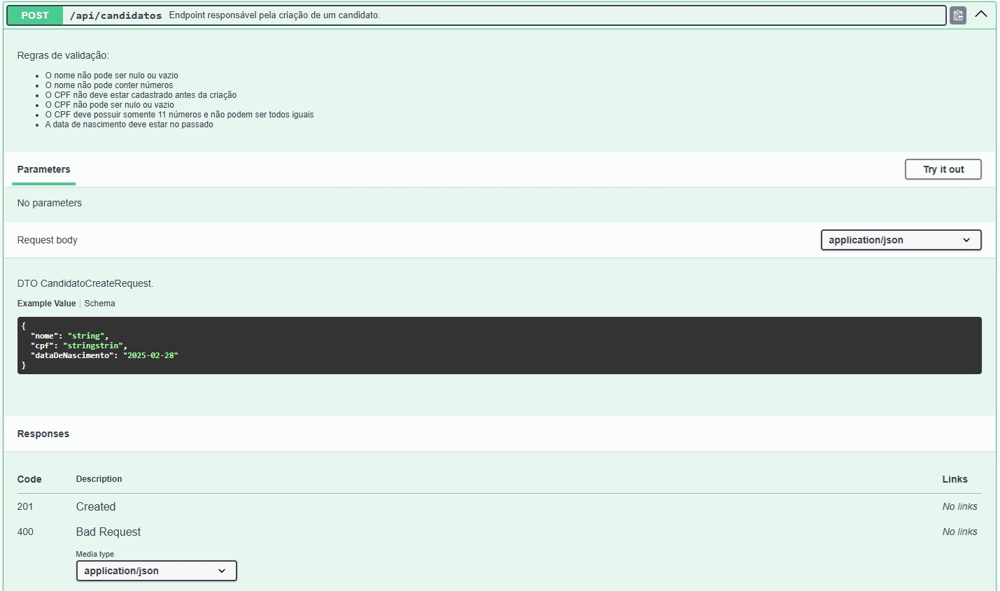
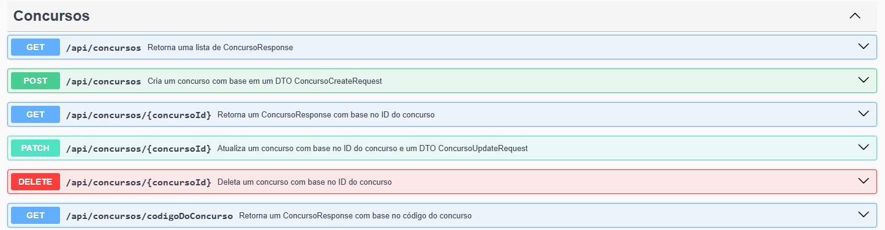
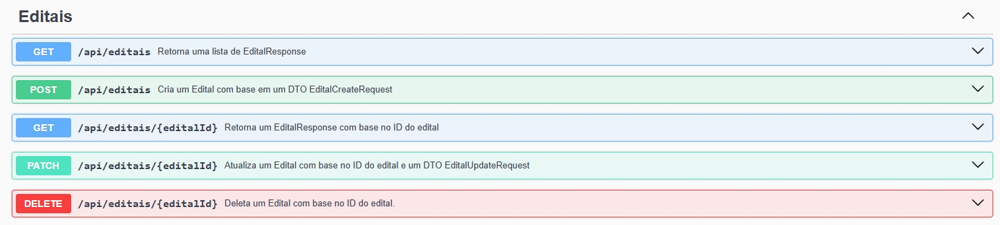
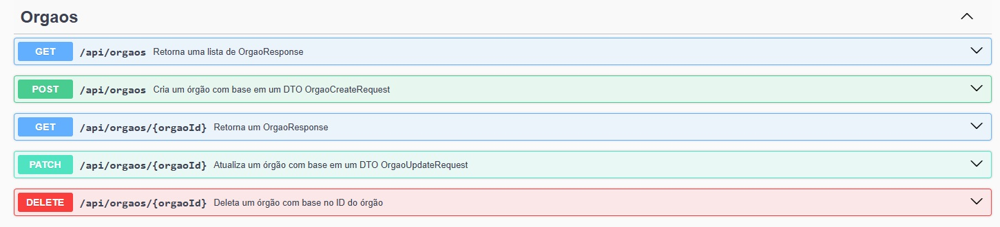
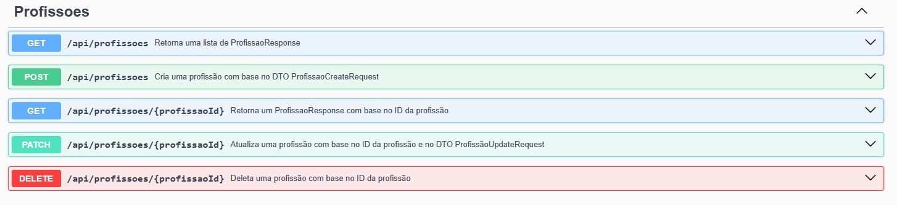
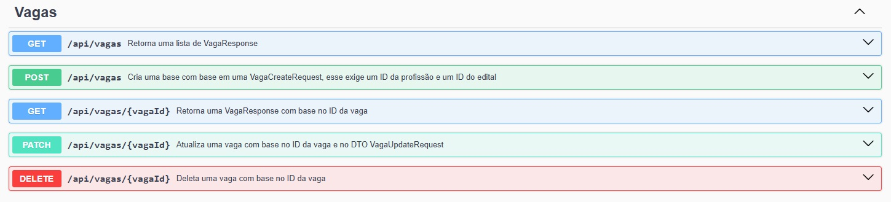
