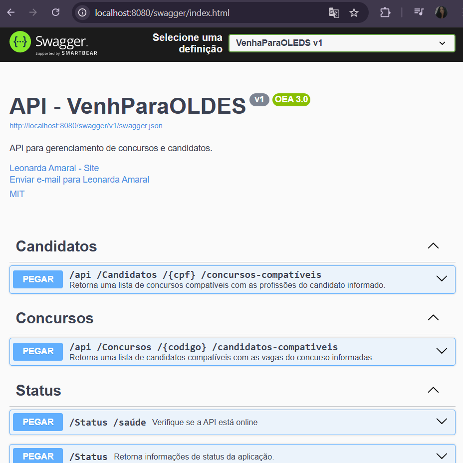

# VenhaParaOLEDS - Backend API

API RESTful desenvolvida para facilitar a compatibilidade entre candidatos e concursos com base em suas profissões. O projeto inclui importação automatizada de dados, documentação via Swagger, testes automatizados e está totalmente conteinerizado via Docker.

## 🔍 Visão Geral

A API possibilita:

- Importação automática de candidatos, concursos e vagas a partir de arquivos `.txt`
- Consulta de concursos compatíveis para um candidato via CPF
- Consulta de candidatos compatíveis para um concurso via código
- Monitoramento de saúde da aplicação com endpoints de status

## 🧰 Tecnologias Utilizadas

- **.NET 8** - ASP.NET Core Web API
- **Entity Framework Core** - Acesso e mapeamento ao banco de dados
- **xUnit** - Testes automatizados
- **Docker & Docker Compose** - Conteinerização da aplicação e do SQL Server
- **SQL Server** - Banco de dados relacional (via Azure Data Studio)
- **Swagger / Swashbuckle** - Documentação automática da API

## 🚀 Como Executar o Projeto Localmente

### Pré-requisitos

- [.NET 8 SDK](https://dotnet.microsoft.com/en-us/download)
- [Docker](https://www.docker.com/)
- Azure Data Studio (opcional, para acessar o banco)

### Passos

```bash
# Clone o repositório
git clone https://github.com/le-amaral/venhaparaoleds-leonarda
cd venhaparaoleds-leonarda

# Execute a aplicação com Docker Compose
docker-compose up --build
```

> A API estará acessível em: `http://localhost:8080`

### Endpoints de Verificação

- `GET /status/health` → Verifica se a API está online
- `GET /status` → Retorna informações do ambiente e versão

## 📚 Documentação da API

Acesse a documentação completa e interativa:

🔗 `http://localhost:8080/swagger`

- Todos os endpoints possuem XML comments
- Testes manuais podem ser feitos via Swagger UI

### ✅ Exemplo de Tela do Swagger




## 📂 Endpoints Principais

### Candidatos

- `GET /api/candidatos/{cpf}/concursos-compatíveis`  
  Retorna todos os concursos que possuem vagas compatíveis com as profissões do candidato informado.

### Concursos

- `GET /api/concursos/{codigo}/candidatos-compativeis`  
  Retorna todos os candidatos com pelo menos uma profissão compatível com as vagas do concurso informado.

## 🧪 Testes Automatizados

Os testes estão localizados no projeto `VenhaParaOLEDS.Tests`:

```bash
dotnet test
```

- Testes de Controllers com `WebApplicationFactory`
- Testes de Services
- Uso de banco de dados InMemory

## 🐳 Docker

### Subir containers (API + SQL Server)

```bash
docker-compose up --build
```

### Dockerfiles e Compose

- `Dockerfile` → API .NET
- `docker-compose.yml` → Orquestração de containers

## 🏗️ Organização do Projeto

```bash
├── Controllers/              # Endpoints da API
├── Data/                     # Contexto EF Core
├── DTOs/                     # Data Transfer Objects
├── Models/                   # Entidades de domínio
├── Services/                 # Lógica de negócio
├── VenhaParaOLEDS.Tests/     # Testes automatizados (xUnit)
└── docker-compose.yml        # Orquestração de containers
```

## ☁️ Deploy Futuro (Opcional)

> Para ambientes de produção ou testes em nuvem, recomenda-se:

- Hospedagem da API via **Azure App Service** ou **Azure Container Apps**
- Banco de dados no **Azure SQL Database**
- CI/CD com **GitHub Actions** e Azure CLI

## 🙌 Contribuindo

1. Faça um fork do projeto
2. Crie uma branch com sua feature: `git checkout -b minha-feature`
3. Commit suas alterações: `git commit -m 'Minha feature'`
4. Push na sua branch: `git push origin minha-feature`
5. Abra um Pull Request

## 📄 Licença

Este projeto está sob a licença MIT.

## 📫 Contato

Projeto mantido pela LEDS e contribuído por [@leonardaamaral](https://github.com/le-amaral)

---

Feito com 💡 e dedicação para a LEDS! ✨
